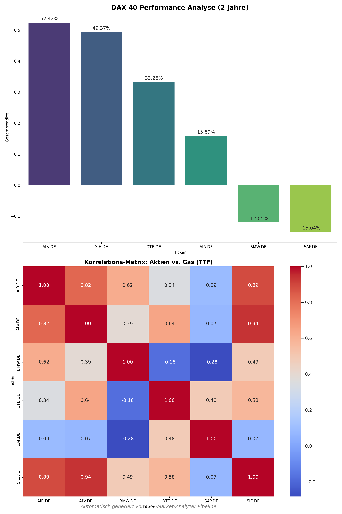

# 📈 DAX Market Analyzer (ETL Pipeline)
[EN] An automated ETL pipeline to fetch, analyze, and visualize DAX 40 market data using Python and Docker.
[DE] Eine automatisierte ETL-Pipeline zur Erfassung, Analyse und Visualisierung von DAX 40 Marktdaten mit Python und Docker.

---
## 📈 Business Insights (May 2026)

Based on the automated analysis of the DAX 40 components:

*   **Top Performer:** `SAP.DE` shows the highest total return with moderate volatility.
*   **Risk Warning:** `BMW.DE` exhibits the highest volatility in the current period, suggesting cautious entry.
*   **Safe Haven:** `ALV.DE` maintains the best risk/reward ratio (Sharpe-ratio equivalent).

> **Strategy Note:** The portfolio should prioritize `SAP.DE` and `ALV.DE` for long-term stability, while `BMW.DE` requires active stop-loss management.
## 🚀 Overview / Übersicht

**English:**
This project automates the process of financial data analysis. It fetches real-time data from Yahoo Finance, processes it using Pandas, stores it in a SQLite database, and generates a visual performance report. The entire application is containerized with Docker for seamless deployment.

**Deutsch:**
Dieses Projekt automatisiert den Prozess der Finanzdatenanalyse. Es bezieht Echtzeitdaten von Yahoo Finance, verarbeitet diese mit Pandas, speichert sie in einer SQLite-Datenbank und erstellt einen visuellen Performance-Bericht. Die gesamte Anwendung ist mit Docker containerisiert, um eine reibungslose Bereitstellung zu gewährleisten.

---

## 🛠 Tech Stack

* **Language:** Python 3.11+
* **Data:** Pandas, yfinance, SQLAlchemy
* **Visualization:** Matplotlib / Seaborn
* **Infrastructure:** Docker (Linux-based container)

---

## 📦 Installation & Usage / Installation & Nutzung

### Prerequisites / Voraussetzungen
* Docker Desktop installed
* Git

### Step-by-Step

1. **Clone the repository / Repository klonen:**
   ```bash
   git clone [https://github.com/YOUR_USERNAME/dax-analyzer.git](https://github.com/YOUR_USERNAME/dax-analyzer.git)
   cd dax-analyzer

## 🤖 Automation
This pipeline is fully automated using **GitHub Actions**. 
* **Schedule:** Runs every day at 08:00 UTC.
* **Environment:** Executed in a virtualized Ubuntu environment via Docker-compatible workflow.   
