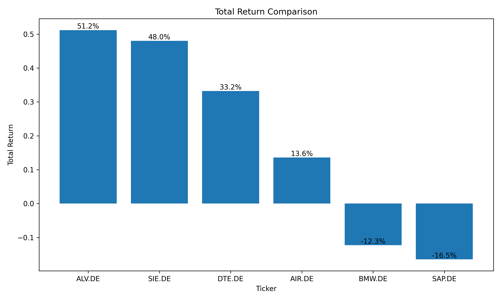
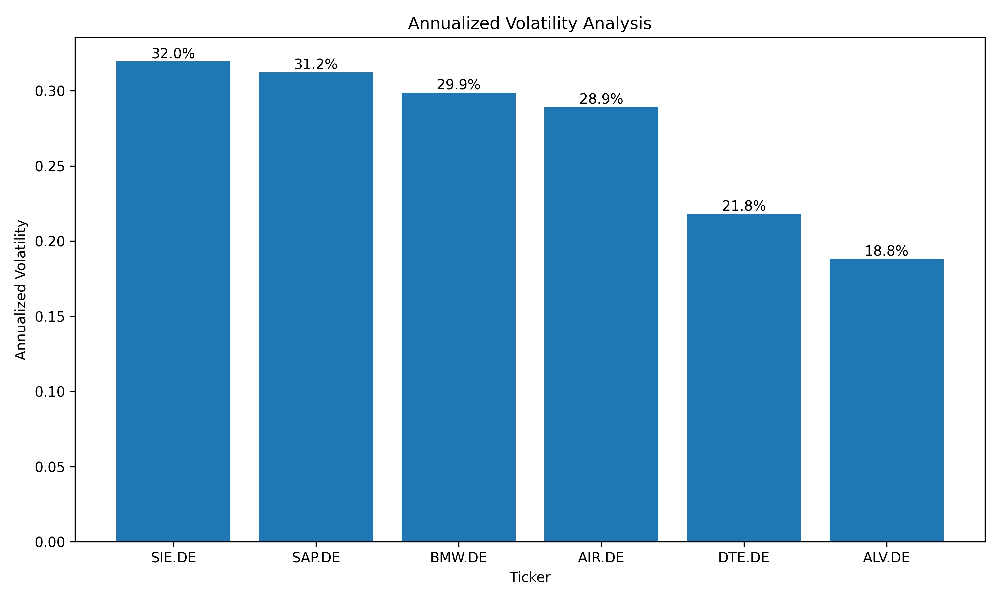
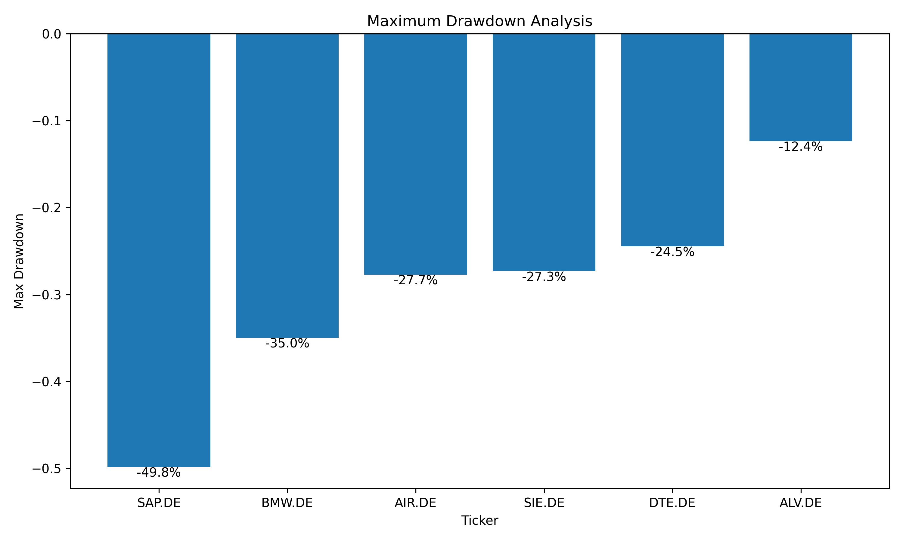

# DAX Market Analyzer

Automated ETL pipeline for DAX equity analytics, risk monitoring, and reporting.

This project extracts historical stock market data from Yahoo Finance, validates and transforms financial time series datasets, calculates financial analytics metrics, stores processed datasets in SQLite, and generates automated visual reports.

The project is designed as a production-style Analytics Engineering portfolio project focused on:

* ETL pipelines
* financial analytics
* data validation
* automation
* reporting workflows
* Dockerized environments
* GitHub Actions automation

---

# Project Overview

The pipeline automates the workflow of collecting and analyzing stock market data for selected DAX companies.

The system performs:

1. Data extraction from Yahoo Finance
2. Validation and preprocessing of financial datasets
3. Financial metric calculations
4. SQLite storage for raw and processed layers
5. Automated report generation
6. Scheduled execution with GitHub Actions

---

# Business Problem

Financial analysts and portfolio managers require automated workflows to monitor market performance, volatility, and downside risk across equities.

This project demonstrates how to build a lightweight analytics pipeline capable of:

* monitoring stock performance automatically
* detecting volatility and drawdown risk
* generating analytics-ready datasets
* automating recurring reporting workflows

---

# Pipeline Architecture

```text
Yahoo Finance API
        ↓
Extract Layer
        ↓
Validation Layer
        ↓
Transformation Layer
        ↓
SQLite Storage
        ↓
Visualization & Reporting
        ↓
GitHub Actions Automation
```

---

# Tech Stack

| Category         | Technologies      |
| ---------------- | ----------------- |
| Programming      | Python            |
| Data Processing  | Pandas, NumPy     |
| Database         | SQLite            |
| Visualization    | Matplotlib        |
| APIs             | Yahoo Finance API |
| Automation       | GitHub Actions    |
| Containerization | Docker            |
| Logging          | Python Logging    |
| CLI              | argparse          |

---

# Analytics Metrics

The pipeline calculates multiple financial analytics metrics:

| Metric                | Description                                          |
| --------------------- | ---------------------------------------------------- |
| Total Return          | Overall asset performance during the analysis period |
| Annualized Volatility | Risk estimation based on daily return variability    |
| Max Drawdown          | Largest historical decline from peak value           |
| Daily Returns         | Percentage-based daily performance tracking          |
| Observation Count     | Number of valid trading observations                 |

---

# Data Validation

The transformation layer includes multiple validation checks:

* empty dataset detection
* required column validation
* missing value checks
* negative price detection
* minimum observation threshold validation
* datetime conversion and sorting

This improves reliability and prevents invalid analytics outputs.

---

# Generated Visualizations

The reporting layer automatically generates visual analytics reports based on processed market data.

### Total Return Comparison

Comparison of cumulative performance across selected DAX equities.



---

### Annualized Volatility Analysis

Risk comparison based on annualized daily return volatility.



---

### Maximum Drawdown Analysis

Visualization of downside risk and historical peak-to-trough declines.



---

# Example Insights

Example analytics insights generated from the pipeline:

* SAP.DE demonstrated strong long-term return performance during the selected period.
* BMW.DE showed higher volatility compared to more defensive equities.
* AIR.DE experienced deeper drawdown risk relative to other selected assets.
* DTE.DE displayed lower volatility characteristics compared to cyclical stocks.

---

# Example Pipeline Logs

```text
2026-05-12 10:22:01 | INFO | __main__ | Starting DAX sample portfolio pipeline.
2026-05-12 10:22:01 | INFO | __main__ | Tracking 6 tickers.
2026-05-12 10:22:04 | INFO | __main__ | Extracted 7560 rows for 6 tickers.
2026-05-12 10:22:05 | INFO | __main__ | Generated 6 analytics records.
2026-05-12 10:22:07 | INFO | __main__ | Pipeline finished successfully in 6.24 seconds.
```

---

# Project Structure

```text
dax-market-analyzer/
│
├── src/
│   ├── extractor.py
│   ├── transformer.py
│   ├── database.py
│   ├── visualizer.py
│
├── reports/
│   ├── total_return.png
│   ├── volatility.png
│   ├── drawdown.png
│
├── .github/workflows/
│
├── Dockerfile
├── requirements.txt
├── main.py
└── README.md
```

---

# Installation

Clone the repository:

```bash
git clone https://github.com/offANTI/dax-market-analyzer.git
cd dax-market-analyzer
```

Create virtual environment:

```bash
python -m venv venv
```

Activate environment:

### Windows

```bash
venv\Scripts\activate
```

### macOS/Linux

```bash
source venv/bin/activate
```

Install dependencies:

```bash
pip install -r requirements.txt
```

---

# CLI Usage

Run full ETL pipeline:

```bash
python main.py --update
```

Generate report from existing database:

```bash
python main.py --report
```

---

# Docker Usage

Build Docker image:

```bash
docker build -t dax-market-analyzer .
```

Run container:

```bash
docker run dax-market-analyzer
```

---

# Automation

The pipeline supports automated execution through GitHub Actions.

Features:

* scheduled daily execution
* automated report generation
* automated SQLite updates
* reproducible Docker environment
* CLI-based execution

---

# Future Improvements

Planned improvements for future project iterations:

* unit and integration tests with pytest
* Ruff and Black linting
* schema validation with Pandera
* Sharpe Ratio calculations
* rolling volatility analysis
* correlation matrix analytics
* anomaly detection for volatility spikes
* Streamlit dashboard integration
* PostgreSQL support
* orchestration with Airflow or Prefect

---

# Key Learning Areas

This project focuses on developing practical Analytics Engineering skills:

* ETL pipeline development
* financial data processing
* analytics-ready data modeling
* automation workflows
* production-style Python project structure
* logging and observability
* reproducible environments
* business-oriented analytics reporting

---

# Disclaimer

This project is intended for educational and portfolio purposes only.

It does not provide financial or investment advice.
